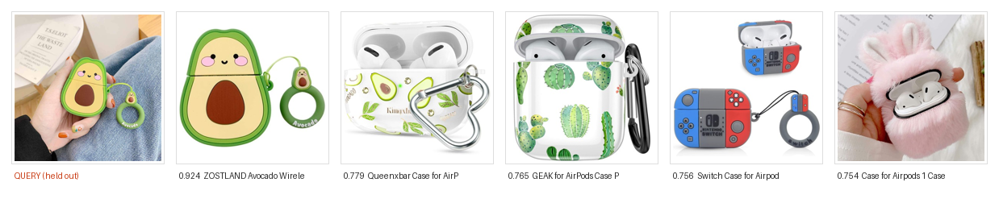
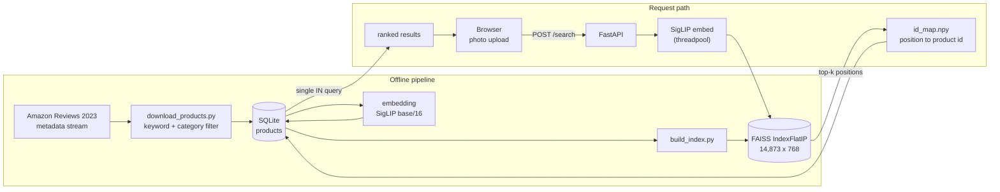

# DormDeals

Visual search for dorm essentials. Upload a photo of any item and get visually
similar products from a catalog of 14,873 searchable items, ranked by SigLIP
embedding similarity.



*A real query. The leftmost image is a held-out listing photo the index never
saw; the five to its right are what came back, with cosine scores. Rank 1 is
the correct product at 0.924, and all five results are AirPods cases.*

*The same query under CLIP returned the correct product at 0.770 followed by a
kids' alarm clock, a mouse jiggler and a pack of animal-topped gel pens — items
matched on colour and silhouette rather than on what they are. That difference
is what the same-type rate below measures: 0.610 for CLIP against 0.866 for
SigLIP.*

## How it works

Products are embedded once, offline, into a 768-dimension SigLIP space and
stored as raw bytes on the product row. A FAISS index is built from those bytes as a
derived artifact, so the database stays the single source of truth. At query
time the uploaded photo goes through the exact same encoder, and an
inner-product search over L2-normalised vectors gives cosine similarity.



## Results

Measured on 2,367 held-out listing images, one per product, against the
14,877-vector index. See the methodology below — the sampling and filtering
matter for reading these.

**Exact-product retrieval** — did the one correct ASIN come back?

| metric | value |
|---|---|
| recall@1 | 0.221 |
| recall@5 | 0.327 (95% CI ±1.9) |
| recall@10 | 0.380 |
| MRR | 0.269 |

**Relevance** — were the results the same kind of thing? Scored against
drawing five products at random from the same index, because a same-type rate
means nothing without knowing what chance already gives.

| metric | retrieved | random | lift |
|---|---|---|---|
| at least one same-type item in top 5 | **0.610** | 0.071 | **8.5x** |
| mean same-type fraction of top 5 | **0.251** | 0.015 | **16.4x** |

Exact-ASIN recall is the harder and less representative number: the catalog
holds hundreds of near-identical black office chairs and white binders, and a
user asking for "a lamp like this one" is well served by a different lamp that
recall scores as a miss. It is reported because it is unambiguous, not because
it is the task.

A deliberately excluded metric: consistency against the six coarse catalog
categories reads 0.893, which looks strong until you notice that five random
draws score 0.606. A 1.5x lift is not evidence of anything, so it is not
claimed.

### How retrieval was measured

Each Amazon listing carries several images. The ingest pipeline embeds exactly
one of them per product — in practice the MAIN catalog shot — and discards the
rest. Those discarded images are the evaluation set: they show the same
product, they were never embedded, and the correct answer is known, since it is
the ASIN they came from. That makes them a held-out set with free labels, and
avoids the circularity of querying an index with an image already inside it.

Two filters keep the measurement honest:

- **Listing graphics are excluded.** A large share of alternate listing images
  are infographics, spec diagrams and advertising banners rather than product
  photography. Retrieving a product from a text banner is not the task this
  system performs, so those queries are dropped by a zero-shot image-type
  classifier before scoring.
- **Near-duplicates are excluded.** Some alternate images are the indexed photo
  re-cropped. Any query scoring above 0.98 cosine against its own indexed
  vector is dropped, so the score cannot be inflated by trivially retrieving the
  same picture.

Queries are sampled one per product, so no product contributes twice and the
trials stay independent.

## Encoder comparison: CLIP vs SigLIP

The catalog was embedded a second time with SigLIP and scored on the identical
query set — same sample, same seed, same filters. Filtering and the
near-duplicate guard always run on CLIP precisely so that swapping the
retrieval encoder cannot change which queries are in the eval set; both runs
report the same n, the same 1,582 graphics dropped and the same 51
near-duplicates, which confirms it held.

| metric | CLIP ViT-B/32 | SigLIP base/16 | change |
|---|---|---|---|
| recall@1 | 0.221 | **0.522** | +30.1 pts |
| recall@5 | 0.327 | **0.690** | +36.3 pts |
| recall@10 | 0.380 | **0.740** | +36.0 pts |
| MRR | 0.269 | **0.594** | +32.5 pts |
| same-type item in top 5 | 0.610 | **0.866** | +25.6 pts |
| mean same-type fraction | 0.251 | **0.451** | +20.0 pts |

SigLIP more than doubles recall@5. A jump that size deserves a leakage check,
since the guard measures self-similarity in CLIP space and a query could in
principle be a near-copy in SigLIP space without being one in CLIP space. On a
250-query sample, SigLIP self-similarity against the indexed image peaks at
0.976 and **no query exceeds the 0.98 threshold**, so nothing slipped through.

**SigLIP now serves `/search`.** It is not free: SigLIP base/16 reads 196
patches per image against CLIP ViT-B/32's 49, roughly 4x the per-image compute,
and its 768-dim vectors make the index 50% larger. End-to-end p50 at one
request went from 60 ms to 134 ms, and peak throughput from ~27 req/s to ~16.
The accuracy is worth it here — this is a search engine, and returning the
right product twice as often matters more than 70 ms — but it is a trade, not
an upgrade. The latency table below was re-measured after the swap, with both
builds running SigLIP so the comparison still isolates the endpoint change.

Two caveats. The SigLIP index holds 14,873 vectors against CLIP's 14,877,
because four product images failed to fetch during embedding; if one of those
four is a query's answer it is an automatic miss for SigLIP, which at 0.03% of
the catalog cannot move the result. And both encoders are frozen — neither was
fine-tuned on this catalog.

## Latency

`/search` measured against the endpoint as it stood before optimisation, which
ran CLIP inline in an `async def` and issued one database query per result.
Both builds were benchmarked sequentially on the same machine, 250 requests per
level, so they never competed for cores.

| concurrency | baseline p95 | current p95 | baseline req/s | current req/s |
|---|---|---|---|---|
| 1 | 124 ms | 145 ms | 8.8 | 7.4 |
| 4 | 738 ms | 434 ms | 7.9 | 14.3 |
| 8 | 1002 ms | 682 ms | 8.6 | 16.1 |
| 16 | 3462 ms | **1231 ms** | 7.5 | **15.9** |

At one concurrent request the optimized build is **17% slower**, and that is
the honest cost of pinning inference to a single thread: one request can no
longer spread across four cores. From four concurrent requests upward it wins
by 32-64%, and throughput roughly doubles. A server is judged on the second
case, so the trade is deliberate — but it is a trade.

The throughput column is the clearer signal. Baseline throughput is flat at
~8 req/s however many clients arrive, because a CPU-bound forward pass on the
event loop serialises everything behind it — additional concurrency buys
nothing and only lengthens the queue. Moving inference to a threadpool lets
throughput scale to ~16 req/s and hold, and the p95 gap widens monotonically
with load: -17%, 41%, 32%, 64%.

**Sweeping concurrency mattered.** An earlier version of the fix looked good at
one request and was 4.5x *worse* at sixteen — p95 of 7.8s against the
baseline's. torch defaults to 4 intra-op threads here, so sixteen
concurrent inferences in a threadpool put up to 64 compute threads on 8 cores
and the machine thrashed. Pinning inference to one thread per request, so
parallelism happens across requests rather than inside them, produced the table
above. A single-request benchmark would have reported a clean win and shipped
the regression.

## Running it

```bash
python -m venv .venv && source .venv/bin/activate
pip install -r requirements.txt
echo "JWT_SECRET_KEY=$(openssl rand -hex 32)" > .env

# data pipeline, in order
cd backend/src
python scripts/download_products.py    # stream + filter the catalog into SQLite
python scripts/fetch_alt_images.py     # capture held-out eval images
python scripts/generate_embeddings.py  # CLIP-embed every product image
python scripts/build_index.py          # write products.index + id_map.npy

uvicorn main:app --reload              # serves on :8000
```

Reproducing the numbers above:

```bash
python scripts/evaluate.py       # writes results/eval_clip.md
python scripts/bench_latency.py  # writes results/bench_latency.md
```

## Stack

FastAPI, SQLAlchemy over SQLite, PyTorch + HuggingFace Transformers for CLIP,
FAISS for vector search, vanilla JS frontend with no build step.

## Known limitations

- **One image per product is indexed.** A product photographed from an angle
  the catalog shot does not show is much harder to retrieve.
- **Exact-instance retrieval is a harder task than the product needs.** The
  numbers above ask whether the precise ASIN was returned; a user looking for
  "a lamp like this one" is well served by a visually similar different lamp
  that the metric scores as a miss.
- **Flat index.** Exact search is the right call at 14,877 vectors, where it
  answers in single-digit milliseconds. It scales linearly, so a materially
  larger catalog would need an approximate index (IVF or HNSW).
- **Marketplace alerts are not built.** The catalog is a static Amazon
  reference set; there is no live local-listing integration yet.
